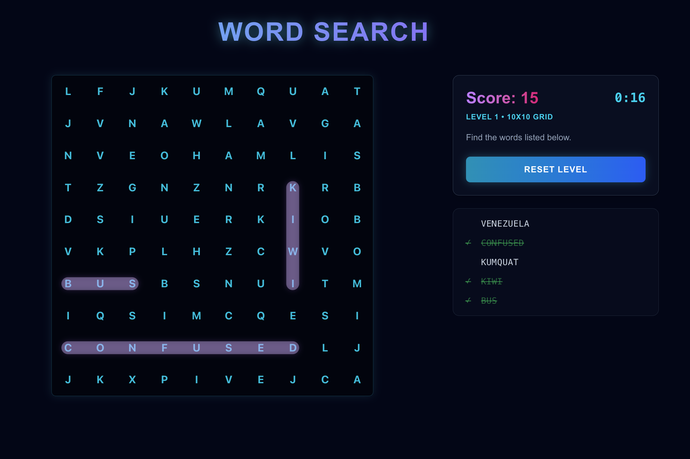

# Neon Word Search 🔍

A futuristic, cyberpunk-themed word search puzzle game built with Next.js and Tailwind CSS. Immerse yourself in a glowing neon world as you race against the clock to find hidden words across multiple difficulty levels.

**[🕹️ Play Here](https://word-search-g.netlify.app/)**



## 🎮 Game Overview

Neon Word Search takes the classic puzzle experience and upgrades it with a sleek, modern aesthetic and interactive gameplay features.

### Key Features

- **Progressive Difficulty**: Start small and work your way up to complex grids.
- **Dynamic Timer**: Race against the clock with challenging time limits for each level.
- **Interactive Audio**: Satisfying sound effects for every action (hover, select, win, lose).
- **Mobile Optimized**: Fully responsive layout with touch-friendly controls.
- **Vast Vocabulary**: Over 19 unique categories including Space, Technology, Emotions, and more.

## 📜 Rules of Engagement

1.  **Objective**: Find all the hidden words listed in the sidebar before the timer runs out.
2.  **Selection**:
    - Words can be placed **Horizontally**, **Vertically**, or **Diagonally**.
    - Click (or touch) and drag to select a word.
3.  **Mistakes**:
    - Selecting a wrong word or a duplicate word will deduct time and show an error.
4.  **Game Over**: If the timer reaches 00:00, the mission fails. You must retry the level.

## 🏆 Levels & Rewards

The game scales in difficulty as you prove your skills:

| Level  | Grid Size | Words to Find | Time Limit | Reward  |
| ------ | --------- | ------------- | ---------- | ------- |
| **1**  | 10x10     | 5             | 60s        | +50 pts |
| **2**  | 12x12     | 10            | 120s       | +50 pts |
| **3+** | 15x15     | 15            | 180s       | +50 pts |

- **Points**: Earn points for every letter in a found word (e.g., "NEON" = 4 points).
- **Victory**: Completing a level unlocks the next challenge.

## 🚀 Getting Started

First, run the development server:

```bash
npm run dev
# or
yarn dev
```

Open [http://localhost:3000](http://localhost:3000) with your browser to start the mission.

## 🛠️ Built With

- **Framework**: Next.js 15 (App Router)
- **Styling**: Tailwind CSS
- **Logic**: TypeScript
- **Audio**: Web Audio API (No external assets required)

## 🤝 Contributing

Contributions are welcome! Whether it's bug fixes, new features, or improvements to the code, we'd love your help.

Please read our [**CONTRIBUTING.md**](CONTRIBUTING.md) for detailed guidelines on:

- 🏗 Development setup
- 🛣 Contribution workflow
- 🎨 Coding standards
- 📋 Pull request checklist
- 💡 Feature roadmap & ideas for contributors

---

_System Status: Online. Ready for player input._
